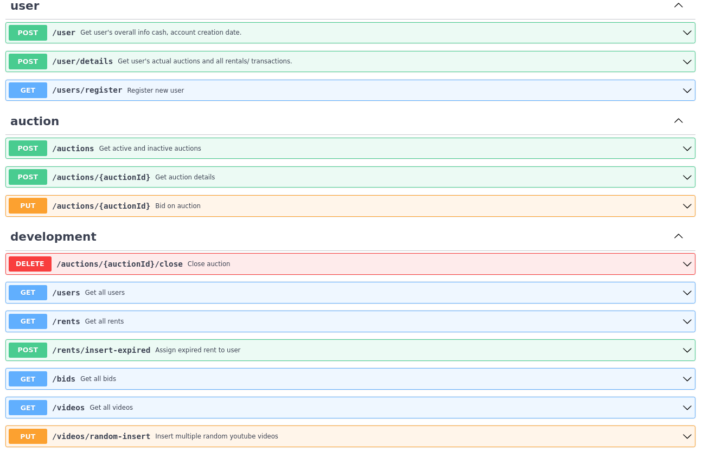
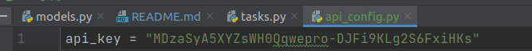
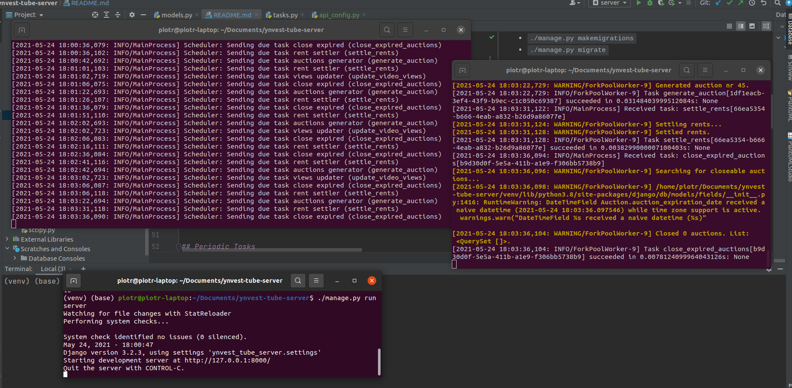

# ynvest-tube-server

  

Server for mobile game [YnvestTube](https://github.com/sqoshi/ynvest-tube). Instructions included in this article
concern Linux systems.

# Table of contests

- [Endpoints](#endpoints)
- [Installation](#installation)
   - [Automatic](#automatic)
   - [Manual](#manual)
- [Launch](#launch)
   - [Automatic](#automatic-1)
   - [Manual](#manual-1)
- [Periodic Tasks](#periodic-tasks)
   - [Auctions closer](#auctions-closer)
   - [Auctions generator](#auctions-generator)
   - [Video updater](#video-updater)
   - [Rents settler](#rents-settler)
- [Technologies](#technologies)

## Endpoints

## Installation

### Automatic

Installation process may be automated via script `install.sh`.

1. `chmod +rwx install.sh`
2. `./install.sh`

### Manual

If script fails in some way, installation may be carried out manually.

YoutubeApi (Optional)

1. You may change api_key in `api_config.py` in `../ynvest_tube_server/ynvest_tube_server/` to key generated
   in [YoutubeDataApi Projects](https://developers.google.com/youtube/v3).

Redis

1. `sudo apt-get install redis`

Requirements

1. `pip install -r requirements.txt`

Migrations (Call migrations, just for sure)

1. `./manage.py makemigrations`
2. `./manage.py migrate`

## Launch

### Automatic

1. `chmod +rwx run_server.sh`
2. `./run_server.sh`

### Manual

If script fails in some way, installation may be carried out manually.

Run three terminals in directory containing `manage.py`. In each one activate python virutalenv
with `source venv/bin/activate` and run subsequent commands, one in one terminal.

1. `celery -A ynvest_tube_server worker -l info -B`
2. `celery -A ynvest_tube_server beat -l info --scheduler django_celery_beat.schedulers:DatabaseScheduler`
3. `./manage.py runserver`

Server is bind to local `http://127.0.0.1:8000/`

## Periodic Tasks

Redis used as a machine is handling calls for periodic tasks. Task scheduler may be configured with django-admin
`localhost:8080/admin` interface.

### Auctions closer 

`( 1call / 1s)`

- changing auction state to inactive
- assign auction to winning user by adding rent to Rent table or passing on none participants
- charges user wallet

### Auctions generator

`(1call / 1800s)`

Generate random auction if there is less than 10 active auctions.

- auction cost = random between 200 and 500 coins  [[OLD]1-5 % of current video views]
- rent duration = random between 1 hour and 7 days
- each auction lasts 15 minutes
- max auctions = 10
- sets video to `auctioned`

### Video updater 

`(1call / 30s) ( max )`

Updates statistics views, likes and dislikes of each video in database via youtube data api v3.

- For now user's cash is being increased by views difference. (rent start, rent end)

### Rents settler 

`( 1call / 1s )`

Payoff users salaries at the end of renting.

- gets rentals with expired date and calculate video diffs
- computes salary and increases user cash
- sets rent to `inactive`
- computes rent profit
- resets video to `available`

## Technologies

- python3
- django
- redis
- bash
- celery
- swagger
