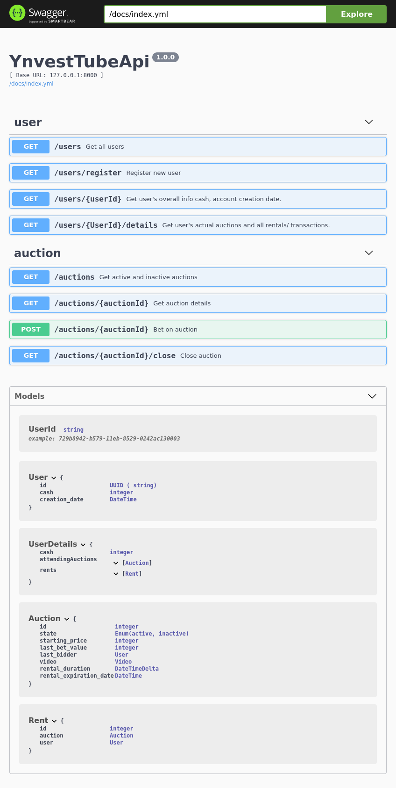

# ynvest-tube-server

# Table of contests

- [Instruction](#instruction)
- [Endpoints](#endpoints)
    - [register](#register)
        - [GET](#get)

## Instruction

`pip install -r requirements.txt`

`./manage.py makemigrations`

`./manage.py migrate`

`./manage.py runserver`

Server is bind to local `http://127.0.0.1:8000/`

## Endpoints
